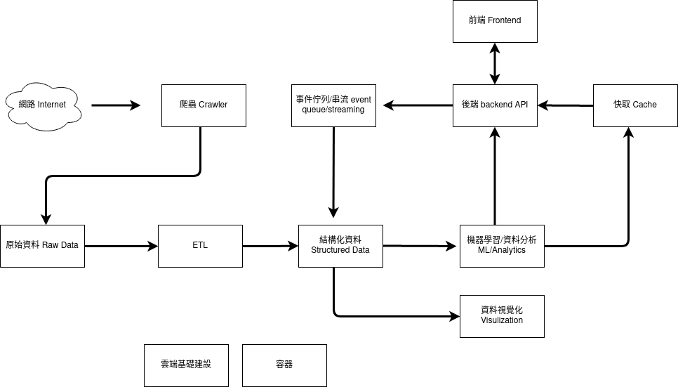
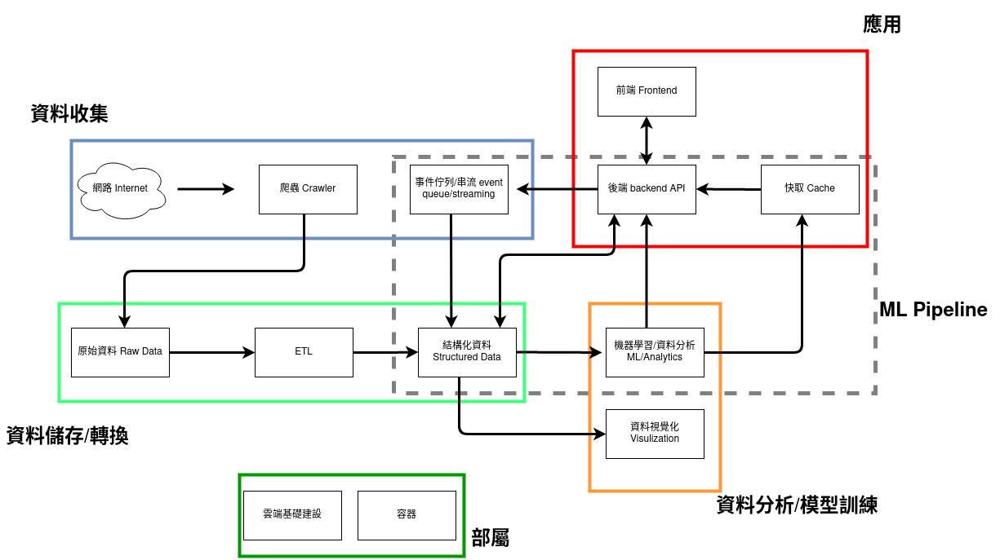

<<<<<<< HEAD
<<<<<<< HEAD
<<<<<<< HEAD
# 架構 architecture
在這裏你會得到我們專案以下架構資訊:
*  Data Piepline 架構
*  Machine Learning  Pipeline 架構
*  Application 架構
*  Infrastructure 架構

## Data Pipeline
我們的 Data Pipeline 如下

根據上圖我們又可以劃分五個區塊:
* 資料收集
* 資料儲存/轉換
* 資料分析/模型訓練
* ML Pipeline
* 應用

其中這些區域裡面分別使用這些工具:

夥伴之間的工作分配是這樣:

### 資料收集
我們認為做這個專案有兩個關鍵因素決定專案的順利與否, 第一個關鍵因素是資料的收集。在我們的情境中, 我們希望收集到每個影集各季的 imdb 評分資訊, 但是 imdb 並沒有這類型的資料來給我們。同時我們也需要收集艾美獎各界的得獎資訊。再收集的過程中我們發現世界上沒有一個地方有系統的整理過去各界艾美獎的各獎項提名或得獎情況。另外在抓爛番茄的評論時, 我們也一直遇到被 ban 的問題。這些問題交稍後一個一個解釋解決方法。

### 資料儲存/轉換
每個人寫的爬蟲都很有個性, 爬下來的資料類型各式各樣, json, csv, txt 圖片等等。這些資料我們統稱非結構型資料。我們使用分散式儲存系統 Hadoop 作為非結構化資料的儲存第一站

服務架構的定義指的是服務之間的關係

## 基礎建設 infra 
基礎建設的定義指的是實體機, 虛擬機, 作業系統與網路串聯設定
專題 infra 架構
=======
# infra
>>>>>>> 2703c3b... Initial commit
=======
# infra
=======
# 服務架構 service architecture
服務架構的定義指的是服務之間的關係
>>>>>>> 3090fd4... Update README.md

# 基礎建設 infra 
基礎建設的定義指的是實體機, 虛擬機, 作業系統與網路串聯設定
專題 infra 架構
>>>>>>> aebdb05... Update README.md
